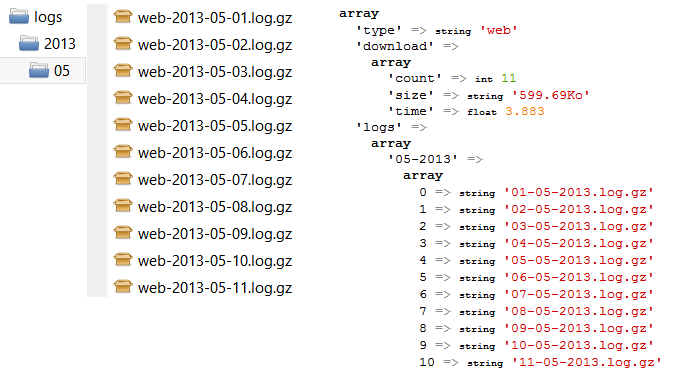

[](https://packagist.org/packages/crazy-max/cws-ovh-logs-downloader)
[](https://php.net/)
[](https://travis-ci.org/crazy-max/CwsOvhLogsDownloader)
[](https://www.codacy.com/app/crazy-max/CwsOvhLogsDownloader)
[](https://styleci.io/repos/9979083)
[](https://libraries.io/github/crazy-max/CwsOvhLogsDownloader)
[](https://beerpay.io/crazy-max/CwsOvhLogsDownloader)
[](https://www.paypal.com/cgi-bin/webscr?cmd=_s-xclick&hosted_button_id=U2NGLLF484NX4)

## About

PHP class to download the Apache access and error, FTP, CGI, Out and SSH logs available on http://logs.ovh.net from a shared hosting.

## Installation

```bash
composer require crazy-max/cws-ovh-logs-downloader
```

And download the code:

```bash
composer install # or update
```

## Getting started

See `tests/test.php` file sample to help you.

## Example



## Methods

**getLogsWeb** - Retrieve logs web.<br />
**getLogsError** - Retrieve logs error.<br />
**getLogsFtp** - Retrieve logs ftp.<br />
**getLogsCgi** - Retrieve logs cgi.<br />
**getLogsOut** - Retrieve logs out.<br />
**getLogsSsh** - Retrieve logs ssh.<br />
**getAll** - Retrieve all logs types.<br />

**setNic** - Set the OVH NIC-handle. (e.g. AB1234-OVH).<br />
**setPassword** - Set the OVH NIC-handle password.<br />
**getDomain** - Your OVH domain.<br />
**setDomain** - Set the OVH domain (e.g. crazyws.fr).<br />
**getDlPath** - The download directory.<br />
**setDlPath** - Set the download directory. (default 'logs/')<br />
**isDlEnable** - Is downloading enable.<br />
**setDlEnable** - Set download activation. (default false)<br />
**isOverwrite** - Is overwriting enable.<br />
**setOverwrite** - Set overwrite activation. (default false)<br />
**getError** - Get the last error.

## How can i help ?

All kinds of contributions are welcomed :raised_hands:!<br />
The most basic way to show your support is to star :star2: the project, or to raise issues :speech_balloon:<br />
But we're not gonna lie to each other, I'd rather you buy me a beer or two :beers:!

[](https://beerpay.io/crazy-max/CwsOvhLogsDownloader)
or [](https://www.paypal.com/cgi-bin/webscr?cmd=_s-xclick&hosted_button_id=U2NGLLF484NX4)

## License

MIT. See `LICENSE` for more details.
